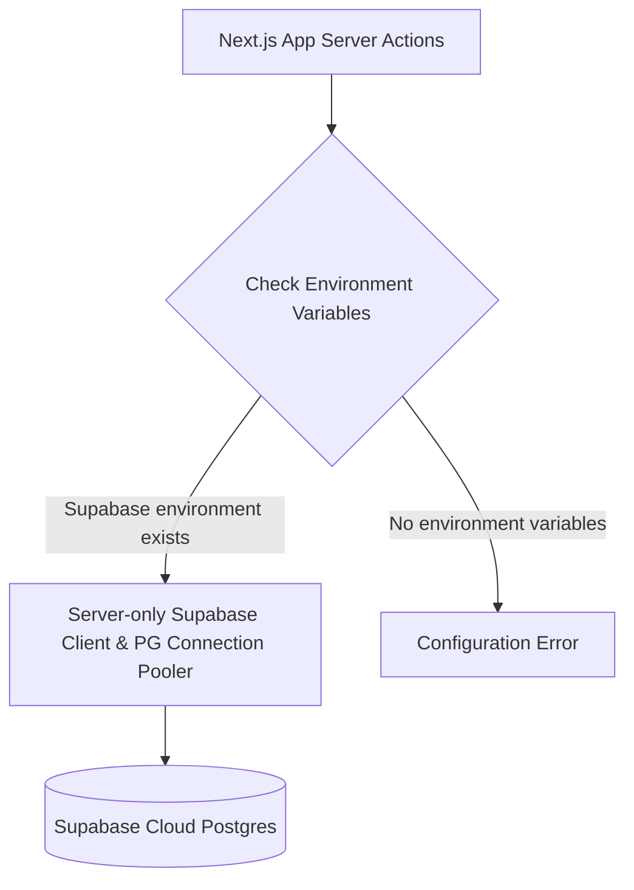

# Call-OS CRM: Complete Database Architecture & Structure Guide

This document provides a highly detailed, comprehensive technical guide to the database architecture, schema definitions, connection mechanics, migration scripts, server actions, and query execution pipelines used in the **Call-OS CRM** application.

---

## 1. Core Database Strategy

The CRM uses Supabase PostgreSQL through authenticated Next.js server actions. Browser clients do not receive privileged database credentials or direct table access.



### 1.1 production Strategy: Supabase PostgreSQL
In production, the application connects to a cloud-hosted PostgreSQL database managed via **Supabase**.
- **Pooler Connection**: Direct SQL operations (like migrations) connect via the Supabase connection pooler on port `6543` using transaction pooling. This handles high concurrency from Next.js serverless functions.
- **REST Interface**: Standard runtime actions use the Supabase JS Client (`@supabase/supabase-js`) to access tables via the PostgREST API over HTTPS, reducing query latency and connection overhead.

### 1.2 Development Strategy
Local development uses the same Supabase-backed server actions as production. Missing environment variables are treated as configuration errors rather than silently switching databases.

---

## 2. Credentials & Connection Details

### 2.1 Production Database Credentials
* **Supabase Project Unique ID**: `bpenacfdynhgcvdznygb`
* **Host Address**: `aws-1-eu-central-1.pooler.supabase.com`
* **Port**: `6543` (Transaction Pooling Port)
* **Master User**: `postgres.bpenacfdynhgcvdznygb`
* **Master Password**: stored outside the repository
* **Database Name**: `postgres`
* **Connection SSL Mode**: Enabled (`ssl={rejectUnauthorized: false}`)
* **Direct URI**: stored in `DATABASE_URL`; never commit it
* **REST API Endpoint**: `https://bpenacfdynhgcvdznygb.supabase.co`

### 2.2 Local Database Path
* **Path**: `C:\Users\elweh\Desktop\WORK\travel_agency_scraper\algeria_travel_agencies.db`

---

## 3. Database Schemas

### 3.1 The `leads` Table
The primary table holding all information about travel agencies, web presence audits, social media stats, calling priorities, assignments, and call outcome logs.

#### Postgres SQL DDL Definition
```sql
CREATE TABLE IF NOT EXISTS leads (
    id SERIAL PRIMARY KEY,
    agency_name VARCHAR(255) NOT NULL,
    area VARCHAR(100) NOT NULL,
    maps_link TEXT DEFAULT NULL,
    address TEXT DEFAULT NULL,
    phone VARCHAR(50) DEFAULT NULL,
    phone_2 VARCHAR(50) DEFAULT NULL,            -- Alt Phone number (Added in CRM V2)
    email VARCHAR(255) DEFAULT NULL,
    email_2 VARCHAR(255) DEFAULT NULL,          -- Alt Email address (Added in CRM V2)
    website VARCHAR(255) DEFAULT NULL,
    website_quality VARCHAR(50) DEFAULT NULL,   -- 'None', 'Low', 'Medium', 'High'
    facebook TEXT DEFAULT NULL,
    instagram TEXT DEFAULT NULL,
    tiktok TEXT DEFAULT NULL,
    linkedin TEXT DEFAULT NULL,
    social_link TEXT DEFAULT NULL,              -- General Social link / LinkedIn URL (Added in CRM V2)
    google_rating DECIMAL(3, 2) DEFAULT 0.00,
    review_count INTEGER DEFAULT 0,
    followers_if_visible VARCHAR(100) DEFAULT NULL,
    facebook_followers VARCHAR(100) DEFAULT NULL,
    instagram_followers VARCHAR(100) DEFAULT NULL,
    running_ads VARCHAR(10) DEFAULT 'No',
    services TEXT DEFAULT NULL,
    notes TEXT DEFAULT NULL,                    -- General scraper or manual notes
    priority INTEGER DEFAULT 3,                 -- 1: High Socials, 2: High Reviews, 3: Standard, 4: Low, 5: Minimal
    call_status VARCHAR(50) DEFAULT 'Not Called',-- 'Not Called', 'Interested', 'Callback', 'Busy', 'No Answer', 'Not Interested', 'Wrong Number', 'Accepted', 'Client Configured'
    call_notes TEXT DEFAULT '',                 -- Last call summary details
    caller_name VARCHAR(100) DEFAULT NULL,      -- Caller who last logged a status
    assigned_to VARCHAR(100) DEFAULT NULL,      -- Caller queue assignment lock
    meeting_date VARCHAR(255) DEFAULT NULL,     -- Next callback/meeting time
    last_called_at TIMESTAMP WITH TIME ZONE DEFAULT NULL,
    last_updated TIMESTAMP WITH TIME ZONE DEFAULT CURRENT_TIMESTAMP
);
```

#### SQLite Schema Mapping
In SQLite, data types map dynamically. `VARCHAR` maps to `TEXT`, `DECIMAL` to `NUMERIC`, and `SERIAL` to `INTEGER PRIMARY KEY AUTOINCREMENT`.

---

### 3.2 The `call_history` Table
A ledger recording every call attempt, log timestamp, caller ID, and notes for audit trails.

#### Postgres SQL DDL Definition
```sql
CREATE TABLE IF NOT EXISTS call_history (
    id SERIAL PRIMARY KEY,
    lead_id INTEGER REFERENCES leads(id) ON DELETE CASCADE,
    caller_name VARCHAR(100) NOT NULL,
    call_status VARCHAR(50) NOT NULL,
    notes TEXT DEFAULT NULL,
    created_at TIMESTAMP WITH TIME ZONE DEFAULT CURRENT_TIMESTAMP
);
```

---

## 4. Connection Management

The Next.js app connects to Supabase only from server actions through `src/lib/supabase-admin.ts`.
The service-role key is never imported into client components, and the deleted SQLite fallback is no longer part of the runtime architecture.

```text
NEXT_PUBLIC_SUPABASE_URL
SUPABASE_SERVICE_ROLE_KEY
SESSION_SECRET
PORTAL_PIN
```

Caller PINs are stored in `caller_profiles.pin` as salted scrypt hashes for newly created profiles. Existing plaintext PINs remain readable only as a migration compatibility path and should be replaced.

---

## 5. DB Migration Scripts

These scripts are kept in the `scripts/` folder ([C:\Users\elweh\Desktop\OS workflow\scripts](file:///C:/Users/elweh/Desktop/OS%20workflow/scripts)):

### 5.1 `alter_database.js`
Alters tables on Supabase (Postgres) and SQLite to add support for multiple contacts and social links.
- **Port used**: `6543` (Pooler)
- **Host target**: `aws-1-eu-central-1.pooler.supabase.com`

```javascript
const { Client } = require('pg');
const sqlite3 = require('sqlite3');

async function migratePostgres() {
  const host = 'aws-1-eu-central-1.pooler.supabase.com';
  console.log(`Connecting to Postgres pooler at: ${host}...`);
  
  const client = new Client({
    host,
    port: 6543,
    user: 'postgres.bpenacfdynhgcvdznygb',
    password: process.env.SUPABASE_DB_PASSWORD,
    database: 'postgres',
    ssl: { rejectUnauthorized: false }
  });

  try {
    await client.connect();
    console.log('Connected. Altering tables...');
    await client.query(`
      ALTER TABLE leads ADD COLUMN IF NOT EXISTS phone_2 TEXT DEFAULT NULL;
      ALTER TABLE leads ADD COLUMN IF NOT EXISTS email_2 TEXT DEFAULT NULL;
      ALTER TABLE leads ADD COLUMN IF NOT EXISTS social_link TEXT DEFAULT NULL;
    `);
    console.log('Postgres alter tables completed.');
    await client.end();
  } catch (err) {
    console.error('Postgres migration failed:', err.message);
  }
}
```

### 5.2 `migrate_database.js`
Initializes columns like `assigned_to` and creates the `call_history` log tables:

```javascript
const { Client } = require('pg');
const connectionString = process.env.DATABASE_URL;

const client = new Client({
  connectionString,
  ssl: { rejectUnauthorized: false }
});

async function migrate() {
  try {
    await client.connect();
    await client.query(`
      ALTER TABLE leads ADD COLUMN IF NOT EXISTS assigned_to TEXT DEFAULT NULL;
      ALTER TABLE leads ADD COLUMN IF NOT EXISTS manual_priority INTEGER DEFAULT NULL;
      
      CREATE TABLE IF NOT EXISTS call_history (
        id SERIAL PRIMARY KEY,
        lead_id INTEGER NOT NULL,
        caller_name VARCHAR(100) NOT NULL,
        call_status VARCHAR(50) NOT NULL,
        notes TEXT,
        created_at TIMESTAMP WITH TIME ZONE DEFAULT CURRENT_TIMESTAMP
      );
    `);
    console.log('Database initialized successfully.');
  } catch (err) {
    console.error('Migration error:', err);
  } finally {
    await client.end();
  }
}
migrate();
```

---

## 6. Server Actions & Query Mechanics

All runtime queries are processed through server actions in [actions.ts](file:///C:/Users/elweh/Desktop/OS%20workflow/src/app/actions.ts):

### 6.1 `getLeads` (Directory Tables)
Loads leads dynamically with sorting parameters, pagination, searching, and filtering.

#### Query Filters Flowchart
```
[Start getLeads] ──> [Apply Text Search] ──> [Filter Directory Status Tab]
                                                    │
    ┌───────────────────────────────────────────────┴───────────────────────────────────────────────┐
    ▼ (tab === 'Followups')                          ▼ (tab === 'GoodClients')                       ▼ (tab === 'database')
[call_status IN (Busy, No Answer)]            [call_status IN (Interested, Won, Accepted...)]    [Exclude lost/converted if excludeLost]
```

#### SQL Implementation
```javascript
export async function getLeads(options: {
  search?: string;
  status?: string;
  priority?: string;
  area?: string;
  page?: number;
  limit?: number;
  excludeLost?: boolean;
}) {
  const { search = '', status = '', priority = '', area = '', page = 1, limit = 20, excludeLost = false } = options;
  const offset = (page - 1) * limit;

  let q = supabase.from('leads').select('*', { count: 'exact' });

  if (search) {
    q = q.or(`agency_name.ilike.%${search}%,phone.ilike.%${search}%,area.ilike.%${search}%,website.ilike.%${search}%`);
  }
  if (status === 'Followups') {
    q = q.in('call_status', ['Busy', 'No Answer']);
  } else if (status === 'GoodClients') {
    q = q.in('call_status', ['Interested', 'Accepted', 'Client Configured']);
  } else if (status) {
    q = q.eq('call_status', status);
  } else if (excludeLost) {
    q = q.not('call_status', 'in', '("Not Interested","Wrong Number","Busy","No Answer","Interested","Accepted","Client Configured")');
  }
  
  if (priority) q = q.eq('priority', parseInt(priority, 10));
  if (area) q = q.ilike('area', `%${area}%`);

  const { data, count, error } = await q
    .order('priority', { ascending: true })
    .order('review_count', { ascending: false })
    .range(offset, offset + limit - 1);
    
  return { success: true, leads: data || [], total: count || 0 };
}
```

---

### 6.2 `getDialerQueue` (Queue Fetching)
Populates the dialing layout for callers.
- **Rules**: Excludes finalized statuses. If a `callerName` is supplied, fetches leads locked to them OR unassigned leads with no logs from other callers.

```javascript
export async function getDialerQueue(callerName?: string) {
  let q = supabase
    .from('leads')
    .select('*')
    .not('call_status', 'in', '("Interested","Not Interested","Wrong Number","Accepted","Client Configured")');

  if (callerName) {
    q = q.or(`assigned_to.eq.${callerName},and(assigned_to.is.null,or(caller_name.is.null,caller_name.eq.${callerName}))`);
  }

  const { data, error } = await q
    .order('priority', { ascending: true })
    .order('review_count', { ascending: false })
    .limit(100);

  return { success: true, queue: data || [] };
}
```

---

### 6.3 `updateCallStatus` (Status Updates & Logs)
Saves status updates, records notes, logs timestamps, locks caller queues, and adds records to `call_history`.

```javascript
export async function updateCallStatus(id: number, status: string, notes: string, callNotes: string, callerName: string) {
  const { error } = await supabase.from('leads').update({
    call_status: status,
    notes,
    call_notes: callNotes,
    caller_name: callerName,
    assigned_to: callerName, // Lock lead to this caller queue
    last_called_at: new Date().toISOString(),
    last_updated: new Date().toISOString(),
  }).eq('id', id);

  if (error) throw new Error(error.message);

  // Insert call_history log entry (fire-and-forget)
  supabase.from('call_history').insert({
    lead_id: id,
    caller_name: callerName,
    call_status: status,
    notes: callNotes || notes
  }).then(({ error: histErr }) => {
    if (histErr) console.warn('[call_history log warning]', histErr.message);
  });

  return { success: true };
}
```

---

### 6.4 `assignLeadsByRange` (Hamid range assignments)
Bulk-assigns target lists to callers by specifying an ID range bracket:

```javascript
export async function assignLeadsByRange(caller: string, startId: number, endId: number) {
  const { error } = await supabase
    .from('leads')
    .update({ assigned_to: caller })
    .gte('id', startId)
    .lte('id', endId);

  if (error) throw new Error(error.message);
  return { success: true };
}
```

---

### 6.5 `getAnalytics` (Admin Analytics Dashboard)
Aggregates status statistics in a single parallel operation.

```javascript
export async function getAnalytics() {
  const [
    totalRes,
    todayRes,
    interestedRes,
    callbackRes,
    notInterestedRes,
    wrongNumberRes,
    noAnswerRes,
    busyRes
  ] = await Promise.all([
    supabase.from('leads').select('*', { count: 'exact', head: true }),
    supabase.from('leads').select('*', { count: 'exact', head: true })
      .gte('last_called_at', new Date(new Date().setHours(0, 0, 0, 0)).toISOString()),
    supabase.from('leads').select('*', { count: 'exact', head: true }).eq('call_status', 'Interested'),
    supabase.from('leads').select('*', { count: 'exact', head: true }).eq('call_status', 'Callback'),
    supabase.from('leads').select('*', { count: 'exact', head: true }).eq('call_status', 'Not Interested'),
    supabase.from('leads').select('*', { count: 'exact', head: true }).eq('call_status', 'Wrong Number'),
    supabase.from('leads').select('*', { count: 'exact', head: true }).eq('call_status', 'No Answer'),
    supabase.from('leads').select('*', { count: 'exact', head: true }).eq('call_status', 'Busy'),
  ]);

  const totalLeads = totalRes.count || 0;
  const interested = interestedRes.count || 0;
  const callback = callbackRes.count || 0;
  const notInterested = notInterestedRes.count || 0;
  const wrongNumber = wrongNumberRes.count || 0;
  const noAnswer = (noAnswerRes.count || 0) + (busyRes.count || 0);

  const totalCalled = interested + callback + notInterested + wrongNumber + noAnswer;

  return {
    success: true,
    stats: {
      totalLeads,
      totalCalled,
      callsToday: todayRes.count || 0,
      statuses: {
        notCalled: totalLeads - totalCalled,
        interested,
        notInterested,
        callback,
        noAnswer,
        wrongNumber,
      }
    }
  };
}
```

---

## 7. Data Flow Workflows

### 7.1 Caller Locking Pipeline
```
[Agent places call to Lead] 
       │
       ▼
[Agent selects outcome status: "Busy / Rang"]
       │
       ▼
[Server updates call_status='Busy', last_called_at=NOW, assigned_to='Oussama']
       │
       ▼
[Lead is hidden from other agents' Dialer Queues. Shows up in Oussama's queue and Followups Tab]
```

### 7.2 ID Range Allocation Pipeline
```
[Hamid enters Oussama & Range: #0 to #400 in Admin dashboard]
       │
       ▼
[Server runs: UPDATE leads SET assigned_to = 'Oussama' WHERE id >= 0 AND id <= 400]
       │
       ▼
[Oussama's Dialer Queue fetches only these leads. General unassigned leads are locked out for him]
```

### 7.3 Multi-Phone Logging Workflow
```
[Agent clicks Phone 2 Dial button on Dialer layout]
       │
       ▼
[State variable dialedNumber is updated to Phone 2 value]
       │
       ▼
[Agent enters call log details & saves]
       │
       ▼
[Notes are appended with: "(Dialed: +213...)". Call outcome details are saved to database]
```
