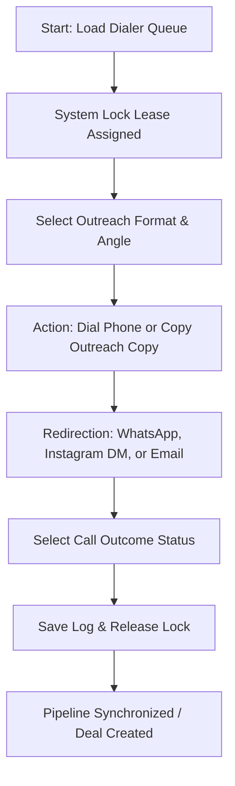

# WEB-OS CRM & Outreach Platform Overview

This document provides a conceptual guide to the design, workflow, and core mechanics of the Web-OS cold outreach CRM. It focuses on the architectural ideas and user flows rather than file listings.

---

## 🎯 1. The Core Idea

The platform is a specialized **Outbound Dialer and Lead Management CRM** built to help outreach teams acquire travel agencies in Algeria. Instead of acting as a generic sales CRM, it is designed from the ground up to support high-velocity cold outreach:
* **The Target Market**: Algerian travel agencies (with or without websites, varying Google Ratings, and active social media presence).
* **The Goal**: Onboard agencies by offering custom web development, mobile optimization, or Google reviews integration.
* **The Approach**: Empower agents (callers) with quick-dial queues, preloaded scripts, and instant clipboard redirection tools to message prospects immediately via WhatsApp, Instagram, or Email.

---

## 🔄 2. The Operational Workflow

A typical day for an outreach agent follows a structured cycle within the application:

### 2.1 Lead Assignment & Dialer Queue
* When a caller logs in, they are presented with a **Dialer Queue** containing fresh (`Not Called`) or explicitly recalled leads assigned to them.
* To prevent duplicate calls, as soon as a lead is selected, a **10-minute Lock Lease** is applied in the database. Other callers will see this lead locked in real-time, preventing concurrent contact.

### 2.2 Script Customization & The outreach Hook
* Before making a call, the agent views the lead's digital footprint (Google ratings, follower counts, site quality).
* The agent selects the best **Outreach Mode/Angle**:
  * **E-Réputation (Avis Google)**: Commends their rating and suggests building a site to capture direct bookings.
  * **Réseaux Sociaux & Visibilité**: Leverages their active social media following to pitch a professional booking landing page.
  * **Audit Technique**: Points out slow loading speeds on their current website.
* The system instantly compiles a professional French outreach script personalized with the prospect's details and the team's portfolio link (`https://castarokio.github.io/`).

### 2.3 Interactive Outreach Execution
* **Phone Call**: The agent clicks the phone number, copying it to the clipboard and loading it into the dialing ledger.
* **Messaging Redirection**: The agent chooses a communication channel (WhatsApp, Instagram, or Messenger). 
  * The copy engine automatically puts the pitch draft into the clipboard and opens the target chat screen. The agent simply taps/pastes and hits send.
* **Email Outreach**: Clicking the email option copies the formatted email draft to the clipboard and launches the default mail client prefilled with CC options for secondary emails.

### 2.4 Logging Outcomes & Pipeline Sync
* After the call, the agent logs the outcome status (e.g., `Interested`, `Callback`, `Wrong Number`, `Accepted`).
* For appointments or callback requests, a scheduler calendar modal allows setting a precise meeting time.
* Once the log is saved:
  * The lock lease is released.
  * The lead is removed from the caller's active dial queue.
  * If the status represents progress (e.g., `Interested` or `Accepted`), a deal is created or synchronized in the **Deals Pipeline** automatically, moving the lead from outreach to the sales pipeline.

---

## ⚙️ 3. How It Works Under the Hood

### 3.1 Real-Time Sync & SSE Broker
To maintain team collaboration, the app uses **Server-Sent Events (SSE)**.
* When caller A locks, unlocks, or changes the status of a lead, the server broadcasts this event.
* All other active caller dashboards listen to this SSE stream and update their queues instantly without page reloads.

### 3.2 Strict Database Constraints & Security
* Callers can only view and update leads assigned to them or unassigned leads.
* A strict **role-based security gate** (Admin, Supervisor, Caller) governs dashboard accessibility, ensuring callers cannot purge logs or reset databases.
* Lock leases automatically expire after 10 minutes, releasing abandoned leads back into the calling pool.

### 3.3 Offline Mode Capabilities
* If an agent loses internet connection during a call, the application caches edits and checklist logs inside `localStorage`.
* Call outcomes logged offline are queued locally. When the system detects the connection is restored, it pushes the queued updates to the database sequentially, maintaining database integrity.
