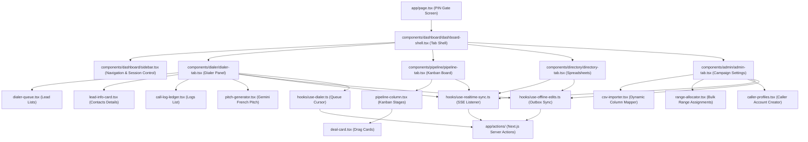
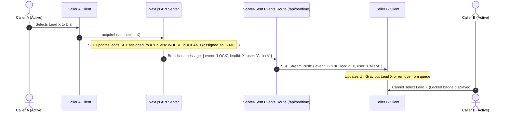
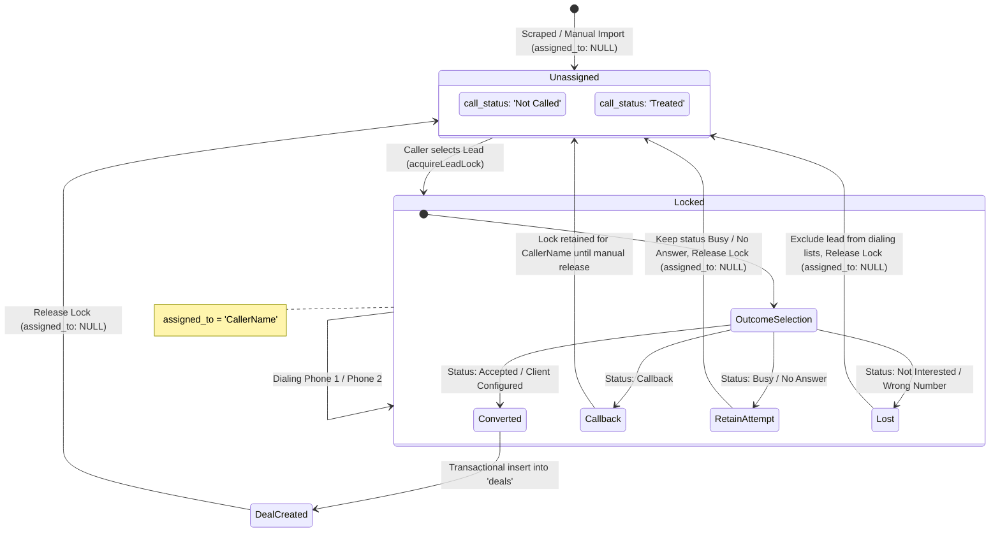
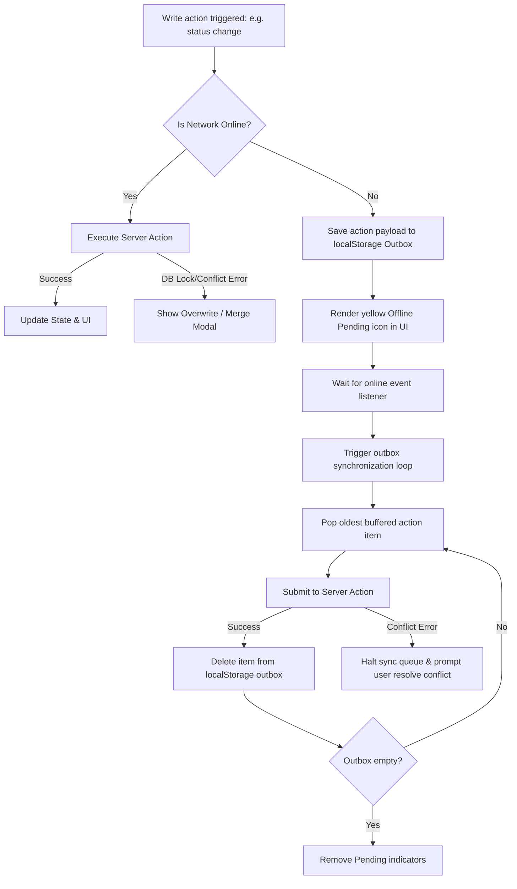
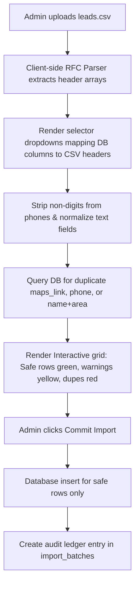
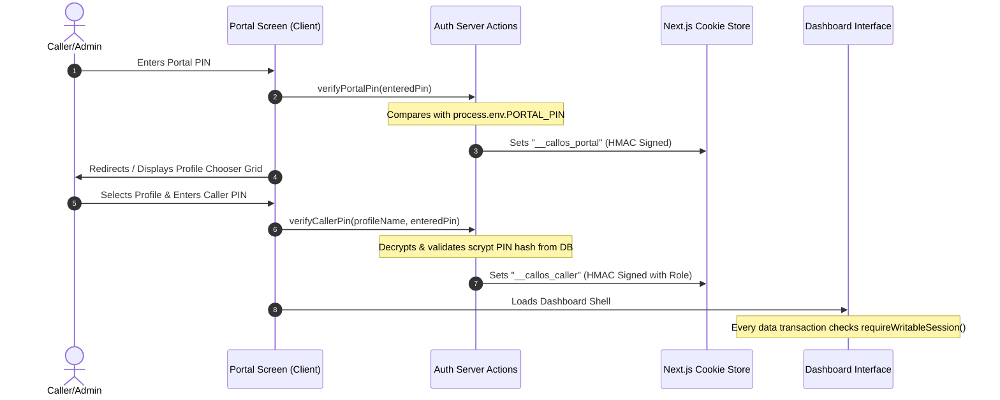

# Rebuild Plan: Call-OS CRM (From Scratch)

This document establishes the architecture, directory structure, data models, light-mode design guidelines, and detailed visual flow charts for rebuilding the **Call-OS CRM** from scratch in this directory.

---

## 🎨 1. Premium Light-Mode Visual Design System

To make the app feel clean, highly professional, and premium (avoiding generic dark themes or neon colors), we will implement a minimalist light-mode system with sophisticated HSL tones and subtle depth.

### 1.1 HSL Color Palette (Alabaster & Slate Core)
- **Base Background**: Clean Light Alabaster/Slate (`hsl(210, 20%, 98%)` to `hsl(0, 0%, 100%)`).
- **Surface Card Panel**: Soft frosted white (`rgba(255, 255, 255, 0.75)`) with a light gray border (`rgba(15, 23, 42, 0.08)`) and high backdrop-blur (`backdrop-blur-lg`).
- **Elevated Surfaces**: Crisp card backings (`hsl(210, 20%, 95%)`) with elegant soft shadows (`shadow-lg shadow-slate-100`).
- **Primary Accent**: Refined Midnight Indigo (`hsl(226, 64%, 32%)`) - deep, high-contrast, professional, and authoritative.
- **Status - Converted/Accepted**: Soft Sage / Forest Green (`hsl(158, 48%, 28%)`) - elegant, muted positive feedback, avoiding bright green.
- **Status - Lost/Lockout**: Sophisticated Burgundy / Crimson Wine (`hsl(344, 54%, 38%)`) - high visibility without looking like generic neon red.
- **Status - Callback/Warning**: Muted Ochre / Warm Amber (`hsl(35, 55%, 36%)`) - soft brassy yellow for callbacks and priorities.

### 1.2 Typography & Depth
- **Display Headings**: Crisp, dark navy text (`text-slate-900`) using premium sans-serif typography like **Outfit** or **Inter** with `font-bold tracking-tight`.
- **Data & Tables**: Elegant clean typography using **Space Grotesk** with high-contrast slate text and monospaced number alignments for review counts and ratings.
- **Shadow Layers**: Instead of colored glows, we use multi-layered soft drop shadows (`shadow-sm`, `shadow-md`, `shadow-xl`) to establish layout hierarchy.

---

## 🏗️ 2. Folder Structure & Rebuilt Component Map

The following map defines the physical folder structures, component separation boundaries, and import dependencies:



---

## 🗄️ 3. Database Schema Specifications

We will interface directly with the following tables on Supabase:

### 3.1 `leads`
```sql
CREATE TABLE leads (
    id SERIAL PRIMARY KEY,
    agency_name VARCHAR(255) NOT NULL,
    area VARCHAR(100) NOT NULL,
    maps_link TEXT DEFAULT NULL,
    address TEXT DEFAULT NULL,
    phone VARCHAR(50) DEFAULT NULL,
    phone_2 VARCHAR(50) DEFAULT NULL,            -- Alternative Phone
    email VARCHAR(255) DEFAULT NULL,
    email_2 VARCHAR(255) DEFAULT NULL,          -- Alternative Email
    website VARCHAR(255) DEFAULT NULL,
    website_quality VARCHAR(50) DEFAULT NULL,   -- 'None', 'Low', 'Medium', 'High'
    facebook TEXT DEFAULT NULL,
    instagram TEXT DEFAULT NULL,
    tiktok TEXT DEFAULT NULL,
    linkedin TEXT DEFAULT NULL,
    social_link TEXT DEFAULT NULL,              -- General Social Link / LinkedIn
    google_rating DECIMAL(3, 2) DEFAULT 0.00,
    review_count INTEGER DEFAULT 0,
    followers_if_visible VARCHAR(100) DEFAULT NULL,
    facebook_followers VARCHAR(100) DEFAULT NULL,
    instagram_followers VARCHAR(100) DEFAULT NULL,
    running_ads VARCHAR(10) DEFAULT 'No',
    services TEXT DEFAULT NULL,
    notes TEXT DEFAULT NULL,                    -- Scraped meta / description notes
    priority INTEGER DEFAULT 3,                 -- Dialer priority (1: High, 5: Low)
    call_status VARCHAR(50) DEFAULT 'Not Called',-- 'Not Called', 'Interested', 'Callback', 'Busy', 'No Answer', 'Not Interested', 'Wrong Number', 'Accepted', 'Client Configured'
    call_notes TEXT DEFAULT '',                 -- Call outcome summary details
    caller_name VARCHAR(100) DEFAULT NULL,      -- Last caller identity
    assigned_to VARCHAR(100) DEFAULT NULL,      -- Lock-out column for exclusive caller dialing
    meeting_date VARCHAR(255) DEFAULT NULL,     -- Date/time string for callbacks
    last_called_at TIMESTAMP WITH TIME ZONE DEFAULT NULL,
    last_updated TIMESTAMP WITH TIME ZONE DEFAULT CURRENT_TIMESTAMP
);
```

### 3.2 `call_history`
```sql
CREATE TABLE call_history (
    id SERIAL PRIMARY KEY,
    lead_id INTEGER REFERENCES leads(id) ON DELETE CASCADE,
    caller_name VARCHAR(100) NOT NULL,
    call_status VARCHAR(50) NOT NULL,
    notes TEXT DEFAULT NULL,
    created_at TIMESTAMP WITH TIME ZONE DEFAULT CURRENT_TIMESTAMP
);
```

### 3.3 `deals`
```sql
CREATE TABLE deals (
    id SERIAL PRIMARY KEY,
    deal_name VARCHAR(255) NOT NULL,
    company_name VARCHAR(255) NOT NULL,
    caller_name VARCHAR(100) NOT NULL,
    lead_id INTEGER REFERENCES leads(id) ON DELETE SET NULL,
    stage VARCHAR(50) NOT NULL DEFAULT 'New',    -- 'New', 'Contacted', 'Proposal Sent', 'Won', 'Lost', etc.
    setup_value NUMERIC(12, 2) DEFAULT 0.00,
    recurring_value NUMERIC(12, 2) DEFAULT 0.00,
    expected_close_date DATE DEFAULT NULL,
    lost_reason TEXT DEFAULT NULL,
    notes TEXT DEFAULT NULL,
    created_at TIMESTAMP WITH TIME ZONE DEFAULT CURRENT_TIMESTAMP,
    updated_at TIMESTAMP WITH TIME ZONE DEFAULT CURRENT_TIMESTAMP
);
```

### 3.4 `caller_profiles`
```sql
CREATE TABLE caller_profiles (
    id SERIAL PRIMARY KEY,
    name VARCHAR(100) UNIQUE NOT NULL,
    pin VARCHAR(255) NOT NULL,                  -- Salted scrypt password hash
    role VARCHAR(50) NOT NULL DEFAULT 'Caller', -- 'Admin', 'Supervisor', 'Caller', 'Viewer'
    daily_call_target INTEGER DEFAULT 80,
    weekly_appointment_target INTEGER DEFAULT 15,
    created_at TIMESTAMP WITH TIME ZONE DEFAULT CURRENT_TIMESTAMP
);
```

---

## ⚡ 4. Deep-Dive Flow Logic & State Diagrams

The following specifications define client state transitions, network communication rules, and backend mutations.

---

### 4.1 Real-Time Lead Lock & Concurrency Loop

This visual flow resolves concurrency conflicts when multiple callers load the dashboard queue.



#### Lock Release Lifecycle:
- **Tab/Change release**: Clicking away from Dialer Tab triggers the `releaseLeadLock` action.
- **Tab Close Beacon**: Closing the browser triggers:
  ```javascript
  window.addEventListener('beforeunload', () => {
    navigator.sendBeacon('/api/unlock-lead', JSON.stringify({ leadId: activeId }));
  });
  ```
- **Inactivity Timeout**: Server queries release locks where `last_updated < NOW() - INTERVAL '10 minutes'`.

---

### 4.2 Lead State Machine & Call Outcome Transitions

Below are the transitions of a lead based on call status and automatic pipeline promotions:



---

### 4.3 Offline-First Synchronization & Outbox Flow

When connectivity drops, client edits buffer locally to guarantee zero data loss.



---

### 4.4 Dynamic CSV Importing & Mapping Pipeline

Allows administrators to import custom tables via visual mapping:



---

### 4.5 Keyboard-Driven Portal & Session Verification Gates

Ensures permissions are authenticated on both Client-Side screens and Server-Side actions:



---

## 📅 5. Step-by-Step Implementation Roadmap

### Phase 1: Foundations & Light Theme Styling
- [ ] **Step 1.1**: Initialize config files (`package.json`, `tsconfig.json`, `globals.css` with HSL light theme variables).
- [ ] **Step 1.2**: Write database connector `lib/supabase-admin.ts` and auth session token utility `lib/auth-session.ts` with signed HTTP-only cookies.
- [ ] **Step 1.3**: Implement the white minimalist PIN Portal UI and profile chooser grid in `src/app/page.tsx`.

### Phase 2: React Custom Hooks & Server Actions
- [ ] **Step 2.1**: Implement server actions `src/app/actions/auth.ts` and `src/app/actions/leads.ts`.
- [ ] **Step 2.2**: Write `/api/realtime` Server-Sent Events endpoint and implement `hooks/use-realtime-sync.ts`.
- [ ] **Step 2.3**: Write custom buffering helper `hooks/use-offline-edits.ts`.

### Phase 3: Modular Dialer (Command Center)
- [ ] **Step 3.1**: Create base presentation components under `/components/ui/` (light glass cards, inputs, tabs).
- [ ] **Step 3.2**: Build `dialer-queue.tsx` and feed it data using the `getDialerQueue` server action.
- [ ] **Step 3.3**: Build `lead-info-card.tsx` with multi-phone support and Gemini-based French pitch generation. Test note logs saving.

### Phase 4: Deals Pipeline (Kanban Board)
- [ ] **Step 4.1**: Create `pipeline-tab.tsx`, column subdivisions, and deal card displays.
- [ ] **Step 4.2**: Add drag-and-drop mechanics to cards updating DB via actions.
- [ ] **Step 4.3**: Integrate automatic deal insertion when lead outcome is marked `Accepted` or `Client Configured`.

### Phase 5: Directory & Admin Campaign Setup
- [ ] **Step 5.1**: Build spreadsheet tabs in `directory-tab.tsx` (Leads, Warm Leads, Callbacks, Lost Leads) with search and pagination.
- [ ] **Step 5.2**: Build Hamid's Range Allocator panel and create the caller profile editor.
- [ ] **Step 5.3**: Build CSV dynamic mapper component and test duplicate-detection loops during importing.
- [ ] **Step 5.4**: Run full production build check: `npm run build`. Verify type completeness and component optimization.

---

## ⚡ 6. Enhanced Developer Workflow (For Speed & Safety)

1. **Strict Type Separation**: Keep UI styling separate from database data fetching. Database queries must only occur within server actions.
2. **Incremental Validation**: After finishing any sub-phase, run compiler verification:
   ```powershell
   npm run build
   ```
   Fix all typescript, build, and lint errors immediately before proceeding.
3. **No UI Placeholders**: All components must be fully interactive, with loading states and proper visual disable styles on button submissions.

---

## 🎨 7. User Interface Layout Wireframes

This section details the layout hierarchy, column divisions, and responsive wireframes for the Light-Mode reconstruction.

### 7.1 Master Application Shell & Sidebar Grid
A clean, two-column layout with a left sidebar navigation controller and an alabaster glass canvas on the right.

```text
+-----------------------------------------------------------------------------------------+
| [CALL-OS CRM]                                           [User: Oussama] [Role: Admin]   |
+-----------------------------------------------------------------------------------------+
| [@] Dialer Queue       | +------------------------------------------------------------+ |
| [#] Deal Pipeline      | |                                                            | |
| [=] Leads Directory    | |                       MAIN VIEWSPACE                       | |
| [*] Admin Settings     | |               (Active component loads here)                | |
|                        | |                                                            | |
|                        | |                                                            | |
| [!] Outbox: 0 Pending  | |                                                            | |
| [X] Logout Profile     | +------------------------------------------------------------+ |
+------------------------+----------------------------------------------------------------+
```

### 7.2 Dialer Command Center Layout (`dialer-tab.tsx`)
A three-pane split designed for fast call sequences, notes logging, and quick copywriting output.

```text
+-----------------------------------------------------------------------------------------+
| SEARCH LEADS: [ Q: Search queue...                                                  ]   |
+--------------------------+-------------------------------+------------------------------+
| LEADS QUEUE              | ACTIVE DIAL CARD              | OUTCOME PANEL                |
|                          |                               |                              |
| 1. MedTour Alger         | Agency: MedTour Alger         | Call Status Outcome:         |
|    Rating: 4.7 (24 revs) | Maps: [maps.google.com/...]   | [ Select outcome...      v ] |
|    Priority: [1]         | Web: [www.medtour.dz]         |                              |
|                          | Quality: Medium               | Meeting / Callback Date:     |
| 2. Safar Voyages Oran    |                               | [ YYYY-MM-DD HH:MM       ]   |
|    Rating: 4.4 (8 revs)  | Contacts:                     |                              |
|    Priority: [1]         | - Phone 1: 0550112233 [Dial 1]| French Outreach Pitch:       |
|                          | - Phone 2: 0770445566 [Dial 2]| +--------------------------+ |
| 3. Oasis Sahara Tour     | - Email 1: info@medtour.dz    | | Bonjour, j'ai analysé    | |
|    Rating: 4.1 (12 revs) | - Email 2: contact@medtour.dz | | votre fiche Maps et...   | |
|    Priority: [2]         |                               | +--------------------------+ |
|                          | Previous Logs:                | [ Copy Pitch ]               |
| 4. Constantine Tours     | [2026-06-03] Caller: Oussama  |                              |
|    Rating: 3.8 (4 revs)  | "Called phone 1, line busy."  | Comments & Logs:             |
|    Priority: [3]         |                               | [ Enter call notes...    ]   |
|                          |                               |                              |
|                          |                               | [ Save Status & Next Lead ]  |
+--------------------------+-------------------------------+------------------------------+
```

### 7.3 Pipeline (Kanban Board) Card Lanes (`pipeline-tab.tsx`)
A horizontal grid of nine stages. Dragging cards from left to right triggers background stage updates.

```text
+-----------------------------------------------------------------------------------------+
| [ + Add Deal ]                                                       Deals Total: (32)  |
+------------+------------+------------+------------+------------+------------+------------+
| NEW (4)    | CONTACT (2)| PROPOSAL(1)| VERIFY (6) | NEGOTIAT(3)| WON (12)   | LOST (4)   |
+------------+------------+------------+------------+------------+------------+------------+
| +--------+ | +--------+ | +--------+ | +--------+ | +--------+ | +--------+ | +--------+ |
| |MedTour | | |Safar   | | |Sahara   | | |Constant | | |Algiers  | | |Tipaza  | | |Batna   | |
| |$250/m  | | |$150/m  | | |$400/m  | | |$300/m   | | |$800/m   | | |$500/m  | | |$200/m  | |
| |Oussama | | |Oussama | | |Hamid   | | |Hamid    | | |Oussama  | | |Oussama | | |Hamid   | |
| +--------+ | +--------+ | +--------+ | +--------+ | +--------+ | +--------+ | +--------+ |
| |Djazair | |            |            | |Annaba   | |            | |Ghardaia  | |          | |
| |$180/m  | |            |            | |$200/m   | |            | |$350/m    | |          | |
| +--------+ |            |            | +--------+ |            | +--------+ |          | |
+------------+------------+------------+------------+------------+------------+------------+
```

### 7.4 Admin CSV Dynamic Column Mapper Layout
A responsive interface that reads custom uploaded file headers, pairs them to PostgreSQL fields, and reviews imports.

```text
STEP 1: Upload CSV File ➔ [ leads_algeria_scraped.csv ]
STEP 2: Map Database Fields:
+---------------------------+---------------------------------+
| target_database_field     | source_csv_header_column        |
+---------------------------+---------------------------------+
| agency_name (Required)    | [ Nom de l'Agence          v ]  |
| phone (Required)          | [ Téléphone Mobile         v ]  |
| area                      | [ Ville / Localité         v ]  |
| maps_link                 | [ Lien Google Maps         v ]  |
| website                   | [ Site Internet            v ]  |
+---------------------------+---------------------------------+

STEP 3: Import Preview Checklist:
+----+--------------------+--------------+-------------------+-------------+-------------------+
| ID | AGENCY NAME        | PHONE        | MAPS LINK         | DUPLICATE?  | STATUS            |
+----+--------------------+--------------+-------------------+-------------+-------------------+
| 01 | MedTour Alger      | +213550112233| maps.google.com/..| No          | [ Ready (Green) ] |
| 02 | Safar Voyages      | +213770445566| maps.google.com/..| No          | [ Ready (Green) ] |
| 03 | Oasis Sahara Tour  | +213661889900|                   | YES (DB)    | [ SKIPPED (Red) ] |
| 04 | Constantine Tours  |              | maps.google.com/..| No          | [ Warning (Yel) ] |
+----+--------------------+--------------+-------------------+-------------+-------------------+
[ IMPORT 3 VALID LEADS ]
```
